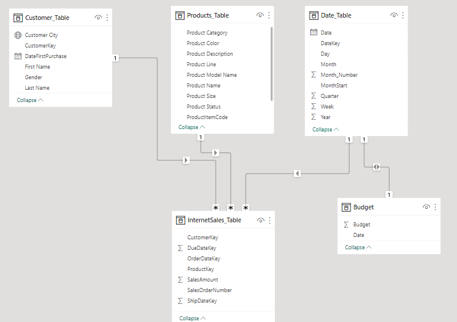
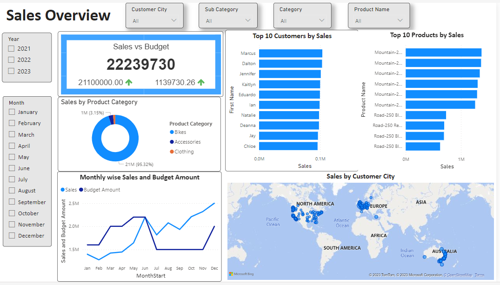

# Sales Management

A PowerBI dashboard on Sales

# Business Requests and User Stories

The business request for this project is to create an executive sales report for sales managers. Below are the objectives from the stakeholders.

* Obtain a dashboard overview of internet sales to track the performance of customers and products, identifying the best-selling ones.
* Access a detailed overview of Internet Sales per Customers, enabling effective follow-up with top buying customers and identifying potential upselling opportunities.
* Access a detailed overview of Internet Sales per Products, allowing effective monitoring of the best-selling products.
* Monitor internet sales over time against the budget through a dashboard equipped with graphs and key performance indicators.
* Utilize a Power BI dashboard that updates data once a day and provides the capability to filter data by customer or product for enhanced analysis and insights.

# Data Cleansing & Transformation (SQL)

To create the necessary data model for conducting analysis and meeting the business needs outlined in the user stories, the following tables were extracted using SQL. All the data sources are in SQL Server, except for the sales budgets, which are in Excel format. The sales budgets data source was connected to the data model in a subsequent step of the process.

The SQL statements for data cleaning and transformation are in the folder **SQL_Queries**

# Data Model

Below is the screenshot of the data model after importing the cleaned and prepared tables into Power BI. This data model illustrates how FACT_Budget has been connected to FACT_InternetSales and other essential DIM tables.

# Sales Management Dashboard

The Sales Management Dashboard is as shown below which consists of three pages. The first page functions as a dashboard and provides an overview of sales performance. The second and third pages show the sales trends over time, both per customer and per product.

**Click the picture to to open the dashboard and try it out!**

)

